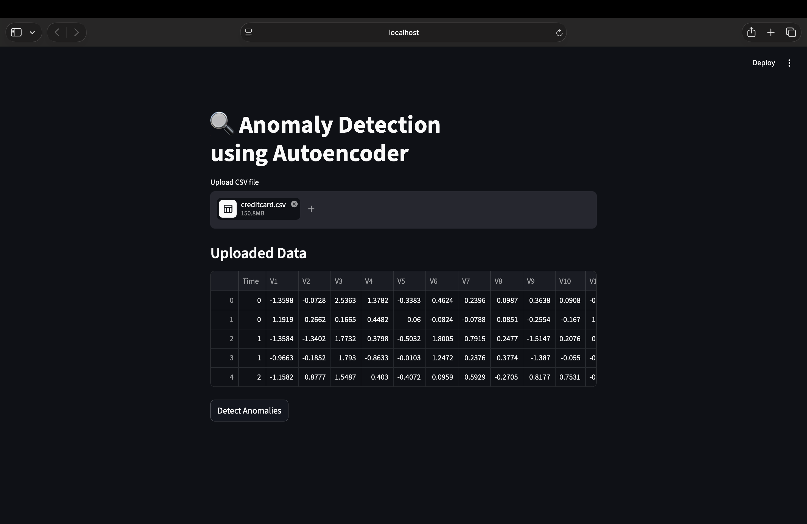
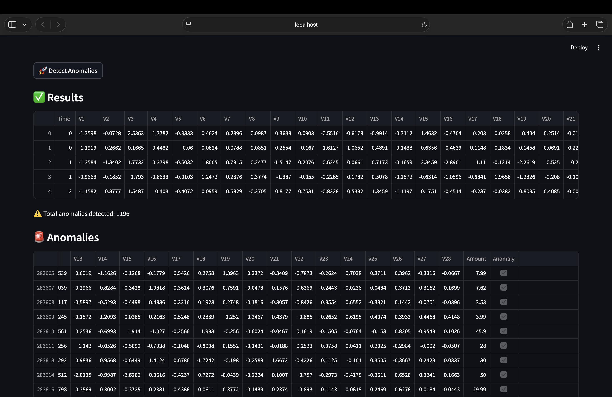

# 🔍 Anomaly Detection using Autoencoder

An end-to-end machine learning system for detecting anomalies in tabular data using an Autoencoder neural network. The project includes model training, inference, and an interactive UI for real-time analysis.

---

## ⚙️ Tech Stack

- Python
- PyTorch
- Pandas / NumPy
- Streamlit (UI)

---

## 🧠 Approach

- Trained an Autoencoder on normal data patterns
- Used reconstruction error to detect anomalies
- Applied statistical thresholding for classification

---

## 📊 Features

- Upload CSV file via UI
- Detect anomalies in real-time
- View filtered anomaly results
- Fully reproducible ML pipeline

---

## 📸 Demo

### Uploaded Data


### Results



---

## ▶️ How to Run

```bash
pip install -r requirements.txt
streamlit run app/streamlit_app.py
